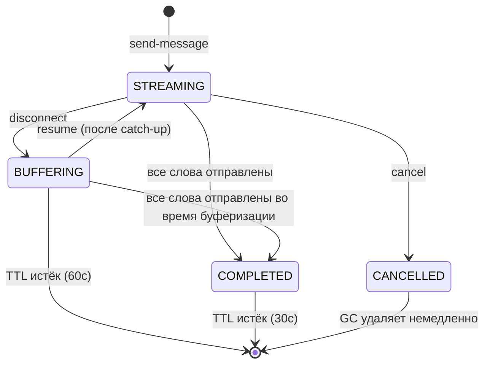

# Заметки для подготовки к интервью

Личная шпаргалка. Не для ревьюеров.

---

## Краткое описание

Это real-time система стримингового чата на NestJS + socket.io (бэкенд) и SwiftUI + socket.io-client-swift (iOS). Сервер стримит предзаданный текст со скоростью 5 слов/сек, поддерживает отмену посреди стрима и прозрачный reconnect/resume. Идентификация сессий через клиентские UUID для переживания реконнектов socket.io. Во время дисконнекта сервер продолжает буферизацию и сбрасывает пропущенные слова пакетом при resume.

---

## Протокол сообщений

| Событие | Направление | Payload | Назначение |
|---------|-------------|---------|------------|
| `send-message` | Клиент -> Сервер | `{ messageId, text }` | Начать стриминг ответа |
| `stream-chunk` | Сервер -> Клиент | `{ messageId, word, index }` | Одно слово стрима |
| `stream-end` | Сервер -> Клиент | `{ messageId, totalWords }` | Стрим завершился нормально |
| `cancel` | Клиент -> Сервер | `{ messageId }` | Остановить стрим |
| `stream-cancelled` | Сервер -> Клиент | `{ messageId, lastIndex }` | Подтверждение отмены |
| `resume` | Клиент -> Сервер | `{ messageId, lastWordIndex }` | Реконнект, запрос на catch-up |
| `catch-up` | Сервер -> Клиент | `{ messageId, words: [{word, index}] }` | Пакет пропущенных слов |
| `error` | Сервер -> Клиент | `{ messageId?, message }` | Уведомление об ошибке |

---

## Стейт-машина



---

## Пошаговый walk-through пути реконнекта

Используйте при демонстрации экрана с кодом. Проходите файлы в указанном порядке.

**Шаг 1: Пользователь отправляет сообщение.**
- `ChatViewModel.swift:36-52` -- `sendMessage()` генерирует UUID, добавляет баблы пользователя и сервера, устанавливает `currentMessageId` и `lastWordIndex = -1`, эмитит `send-message`.
- `chat.gateway.ts:65-112` -- `handleSendMessage` валидирует payload, создаёт `StreamSession`, связывает сокет с сообщением через `linkSocketToMessage`, вызывает `session.start()`.
- `stream-session.ts:42-49` -- `start()` сохраняет socketId и callback, запускает `setInterval` с интервалом 200мс.

**Шаг 2: Слова стримятся со скоростью 5 слов/сек.**
- `stream-session.ts:53-79` -- `tick()` читает `words[currentIndex]`, эмитит `stream-chunk` через callback.
- `chat.gateway.ts:103-108` -- Callback разрешает текущий socketId и отправляет через `server.to(socketId)`.
- `ChatViewModel.swift:83-86` -- `onStreamChunk` вызывает `appendWord`.
- `ChatViewModel.swift:130-139` -- `appendWord` проверяет `index > lastWordIndex`, дописывает слово в `streamedText`.

**Шаг 3: Сеть падает.**
- `chat.gateway.ts:43-61` -- Срабатывает `handleDisconnect`. Итерирует `socketToMessages` для данного сокета. Вызывает `session.pause()` для каждого сообщения.
- `stream-session.ts:100-112` -- `pause()` устанавливает состояние `BUFFERING`, обнуляет `socketId` и `emitCb`, записывает `disconnectedAt`. Таймер продолжает работать.
- `stream-session.ts:69-71` -- Последующие тики попадают в ветку `BUFFERING`: `this.buffer.push({ word, index })`.

**Шаг 4: Клиентская сторона во время дисконнекта.**
- `SocketService.swift:86-91` -- Срабатывает callback дисконнекта.
- `ChatViewModel.swift:78-81` -- Устанавливает `connectionState = .reconnecting`.
- `ChatView.swift:10-12` -- Появляется `ConnectionBanner`.

**Шаг 5: Сеть восстановилась, клиент автоматически переподключается.**
- `SocketService.swift:35-37` -- Конфигурация socket.io-client-swift: `reconnects(true)`, `reconnectWait(1)`, `reconnectWaitMax(5)`.
- `SocketService.swift:80-84` -- Срабатывает handler подключения.
- `ChatViewModel.swift:65-76` -- `onConnect` устанавливает `.connected`. Обнаруживает активный стрим (`currentMessageId != nil && isStreaming`). Вызывает `socketService.resumeStream(messageId:, lastWordIndex:)`.
- `SocketService.swift:68-73` -- Эмитит событие `resume`.

**Шаг 6: Сервер обрабатывает resume.**
- `chat.gateway.ts:142-199` -- `handleResume` валидирует, находит сессию, обновляет маппинги сокетов (`unlinkMessage` + `linkSocketToMessage`), создаёт новый emit callback, вызывает `session.resume()`.
- `stream-session.ts:118-153` -- `resume()` восстанавливает пропущенные слова из `words[lastWordIndex+1..currentIndex-1]`, очищает буфер, устанавливает состояние `STREAMING`.
- `chat.gateway.ts:192-194` -- Эмитит `catch-up`, если есть пропущенные слова.

**Шаг 7: Клиент обрабатывает catch-up и возобновляет приём.**
- `ChatViewModel.swift:95-100` -- `onCatchUp` итерирует слова, вызывает `appendWord` для каждого.
- `ChatViewModel.swift:135` -- Guard `index > lastWordIndex` предотвращает дубликаты.
- Обычные события `stream-chunk` продолжают приходить на новом сокете.

---

## Ответы на ожидаемые вопросы

### 1. Как работает WebSocket соединение?

Бэкенд использует `@WebSocketGateway` из NestJS, который оборачивает socket.io. iOS-клиент использует официальную библиотеку `socket.io-client-swift` с принудительным WebSocket транспортом и авто-реконнектом. При подключении сервер логирует socket ID. Клиент может сразу эмитить события. Вся коммуникация строится на именованных событиях с JSON payload, идентифицируемых через `messageId`.

### 2. Как реализован стриминг?

`setInterval` с интервалом 200мс (5 слов/сек) продвигается по массиву слов. Каждый тик читает слово по текущему индексу и эмитит событие `stream-chunk` со словом и его индексом. Клиент дописывает каждое слово к отображаемому тексту. Когда все слова отправлены, сервер эмитит `stream-end` и очищает таймер.

### 3. Как отмена останавливает ответ сервера?

Клиент эмитит событие `cancel` с `messageId`. Сервер находит соответствующую `StreamSession`, вызывает `cancel()`, который очищает interval-таймер и помечает состояние как `CANCELLED`. Сервер эмитит `stream-cancelled` обратно клиенту и уничтожает сессию. Клиент помечает сообщение как завершённое и показывает частичный текст как финальный.

### 4. Как работает reconnect/resume после временного дисконнекта?

При дисконнекте сервер ставит сессию на паузу, но оставляет таймер работающим -- слова идут во внутренний буфер вместо сокета. Когда клиент переподключается (новый socket.id), он обнаруживает активный стрим и эмитит `resume` с индексом последнего полученного слова. Сервер восстанавливает все пропущенные слова из корпуса, отправляет их единым пакетом `catch-up`, перепривязывает emit callback к новому сокету и возобновляет обычный стриминг.

### 5. Какие компромиссы вы приняли?

In-memory хранилище означает отсутствие персистентности при перезапуске сервера. Буферизация вместо паузы означает, что сервер делает лишнюю работу, если клиент не вернётся, но обеспечивает мгновенный catch-up, что ощущается гораздо лучше. Нет аутентификации, горизонтального масштабирования, backpressure. TTL 60с для буферизируемых сессий -- практичный дефолт, но произвольный.

### 6. Что бы вы улучшили, имея больше времени?

Сессии в Redis для горизонтального масштабирования. JWT-аутентификация на handshake socket.io. Обнаружение backpressure (проверка writability транспорта перед отправкой). Rate limiting. Персистентная история чата в базе данных. E2E-тесты с реальным iOS-симулятором. Метрики Prometheus для активных сессий и частоты реконнектов. Настраиваемая скорость стриминга.

---

## Вероятные follow-up вопросы

### 1. Что если два устройства используют один messageId?

Они будут конфликтовать. Когда устройство B отправляет `resume` для того же messageId, сервер перепривязывает emit callback к сокету устройства B. Устройство A перестанет получать chunks. В продакшене аутентификация привязывала бы messageId к паре пользователь/устройство.

### 2. Почему буферизация, а не пауза?

Буферизация имитирует поведение LLM -- модель не прекращает генерацию из-за того, что клиент отключился. Это обеспечивает мгновенный catch-up: все пропущенные слова уже вычислены. Пауза означала бы, что пользователь ждёт оставшееся время стрима после реконнекта, что ощущается сломанным.

### 3. Как масштабировать на N серверов?

Сейчас -- никак, сессии хранятся в памяти процесса. Понадобятся Redis или аналогичное хранилище для состояния сессий, плюс sticky sessions или socket.io-адаптер на Redis (`@socket.io/redis-adapter`), чтобы события маршрутизировались на правильный сервер.

### 4. Что сломается при рестарте сервера во время стрима?

Всё. Все сессии теряются. Клиент переподключится, эмитнет `resume` и получит ошибку ("No session found"). Понадобится персистентное хранилище сессий для переживания рестартов.

### 5. Как предотвращаются дубликаты слов после catch-up?

Клиент отслеживает `lastWordIndex` (`ChatViewModel.swift:135`). Метод `appendWord` содержит guard `index > lastWordIndex` -- если индекс слова равен или меньше того, что уже есть, слово молча отбрасывается.

### 6. Почему socket.io, а не сырой WebSocket?

Socket.io даёт структурированные события (именованные каналы), автоматический реконнект с backoff, emit по room (`server.to(socketId)`) и Engine.IO фрейминг/heartbeat. С сырым WebSocket всё это нужно строить вручную, плюс обрабатывать бинарный фрейминг.

### 7. Что произойдёт при resume с несуществующим messageId?

Сервер вернёт событие `error`: `"No session found for this messageId"` (`chat.gateway.ts:163-167`). Клиент получит его и добавит сообщение об ошибке в чат.

### 8. Можно ли использовать Server-Sent Events вместо WebSocket?

SSE однонаправлен (только сервер к клиенту). Для клиентских событий (cancel, resume) понадобился бы отдельный канал. WebSocket/socket.io даёт двунаправленную коммуникацию на одном соединении, что проще для данного use case.

### 9. Как добавить аутентификацию?

JWT middleware на handshake socket.io. Клиент отправляет токен в `auth` при подключении. Сервер проверяет его в NestJS guard или middleware перед разрешением соединения. При resume также нужно проверять, что аутентифицированный пользователь владеет данным messageId.

### 10. Что если текст будет миллион слов?

Буфер вырастет до огромных размеров. Нужно ограничить размер буфера, стримить с диска/базы данных вместо удержания всего корпуса в памяти, и реализовать backpressure. Текущий подход с `CORPUS_WORDS` как in-memory массивом работает для ~500 слов, но не для миллионов.

---

## Пять запросов на live-изменения с точными диффами

### 1. Изменить скорость стриминга на 10 слов/сек

**Файл:** `backend/src/chat/stream-session.ts`

Изменение на строке 47-49. Интервал уменьшается с 200мс до 100мс, удваивая скорость с 5 до 10 слов/сек.

До:
```typescript
this.timer = setInterval(() => {
  this.tick();
}, 200);
```

После:
```typescript
this.timer = setInterval(() => {
  this.tick();
}, 100);
```

---

### 2. Добавить typing indicator

**Файл:** `backend/src/chat/stream-session.ts`

В метод `start` (строка 42-49) добавляется emit `typing-start` перед запуском таймера.

До:
```typescript
start(socketId: string, emitCallback: EmitCallback): void {
  this.socketId = socketId;
  this.emitCb = emitCallback;
  this.state = SessionState.STREAMING;

  this.timer = setInterval(() => {
    this.tick();
  }, 200);
}
```

После:
```typescript
start(socketId: string, emitCallback: EmitCallback): void {
  this.socketId = socketId;
  this.emitCb = emitCallback;
  this.state = SessionState.STREAMING;

  emitCallback('typing-start', { messageId: this.messageId });

  this.timer = setInterval(() => {
    this.tick();
  }, 200);
}
```

В метод `complete` (строка 82-93) добавляется emit `typing-stop` перед `stream-end`.

До:
```typescript
private complete(): void {
  this.clearTimer();

  if (this.state === SessionState.STREAMING && this.emitCb) {
    this.emitCb('stream-end', {
      messageId: this.messageId,
      totalWords: this.words.length,
    });
  }

  this.state = SessionState.COMPLETED;
  this.disconnectedAt = Date.now();
}
```

После:
```typescript
private complete(): void {
  this.clearTimer();

  if (this.state === SessionState.STREAMING && this.emitCb) {
    this.emitCb('typing-stop', { messageId: this.messageId });
    this.emitCb('stream-end', {
      messageId: this.messageId,
      totalWords: this.words.length,
    });
  }

  this.state = SessionState.COMPLETED;
  this.disconnectedAt = Date.now();
}
```

---

### 3. Персистировать сессии в Redis

**Файл:** `backend/src/chat/session-manager.ts`

Концептуальное изменение -- требует зависимость `ioredis`. Заменяет in-memory `Map` на Redis-backed хранилище.

До:
```typescript
@Injectable()
export class SessionManager implements OnModuleDestroy {
  private readonly logger = new Logger(SessionManager.name);
  public readonly sessions = new Map<string, StreamSession>();
```

После:
```typescript
import Redis from 'ioredis';

@Injectable()
export class SessionManager implements OnModuleDestroy {
  private readonly logger = new Logger(SessionManager.name);
  private readonly redis = new Redis(process.env.REDIS_URL);
  public readonly sessions = new Map<string, StreamSession>(); // локальный кеш

  async persistSession(messageId: string, session: StreamSession): Promise<void> {
    await this.redis.set(
      `session:${messageId}`,
      JSON.stringify({
        messageId: session.messageId,
        currentIndex: session.currentIndex,
        state: session.state,
        buffer: session.buffer,
      }),
      'EX',
      60,
    );
  }

  async restoreSession(messageId: string): Promise<StreamSession | undefined> {
    const data = await this.redis.get(`session:${messageId}`);
    if (!data) return undefined;
    const parsed = JSON.parse(data);
    const session = new StreamSession(parsed.messageId);
    session.currentIndex = parsed.currentIndex;
    session.state = parsed.state;
    session.buffer = parsed.buffer;
    return session;
  }
```

Также нужно вызывать `persistSession` в пути `pause()` и `restoreSession` в пути `handleResume`.

---

### 4. Добавить JWT-аутентификацию

**Файл:** `backend/src/chat/chat.gateway.ts`

Добавляется middleware на handshake socket.io, которое проверяет JWT-токен перед разрешением соединения.

До:
```typescript
@WebSocketGateway({ cors: { origin: '*' } })
export class ChatGateway implements OnGatewayConnection, OnGatewayDisconnect {
```

После:
```typescript
import { verify } from 'jsonwebtoken';

@WebSocketGateway({ cors: { origin: '*' } })
export class ChatGateway implements OnGatewayConnection, OnGatewayDisconnect {
  @WebSocketServer()
  server!: Server;

  afterInit(server: Server): void {
    server.use((socket, next) => {
      const token = socket.handshake.auth?.token;
      if (!token) {
        return next(new Error('Authentication required'));
      }
      try {
        const payload = verify(token, process.env.JWT_SECRET!);
        (socket as any).userId = (payload as any).sub;
        next();
      } catch {
        next(new Error('Invalid token'));
      }
    });
  }
```

На стороне iOS в `SocketService.swift` (строка 30-42) добавляется токен в конфигурацию:

До:
```swift
manager = SocketManager(
    socketURL: Self.serverURL,
    config: [
        .forceWebsockets(true),
        .reconnects(true),
        .reconnectWait(1),
        .reconnectWaitMax(5),
        .log(false)
    ]
)
```

После:
```swift
manager = SocketManager(
    socketURL: Self.serverURL,
    config: [
        .forceWebsockets(true),
        .reconnects(true),
        .reconnectWait(1),
        .reconnectWaitMax(5),
        .connectParams(["token": authToken]),
        .log(false)
    ]
)
```

---

### 5. Добавить backpressure

**Файл:** `backend/src/chat/stream-session.ts`

В метод `tick` (строка 62-68) добавляется проверка writability сокета перед отправкой. Если буфер транспорта переполнен, слово уходит в локальный буфер.

До:
```typescript
if (this.state === SessionState.STREAMING && this.emitCb) {
  const payload: StreamChunkPayload = {
    messageId: this.messageId,
    word,
    index,
  };
  this.emitCb('stream-chunk', payload);
}
```

После:
```typescript
if (this.state === SessionState.STREAMING && this.emitCb) {
  if (this.socketWritable) {
    const payload: StreamChunkPayload = {
      messageId: this.messageId,
      word,
      index,
    };
    this.emitCb('stream-chunk', payload);
  } else {
    // Буфер сокета переполнен; буферизуем локально до drain
    this.buffer.push({ word, index });
  }
}
```

Добавляется флаг `socketWritable` и обработчик `drain` в gateway (`chat.gateway.ts`), после привязки сокета:

```typescript
// В chat.gateway.ts, после linkSocketToMessage:
socket.conn.on('drain', () => {
  const session = this.sessionManager.getSession(messageId);
  if (session) session.socketWritable = true;
});
```

Это предотвращает переполнение медленного клиента и включает локальную буферизацию, когда транспорт не справляется.
