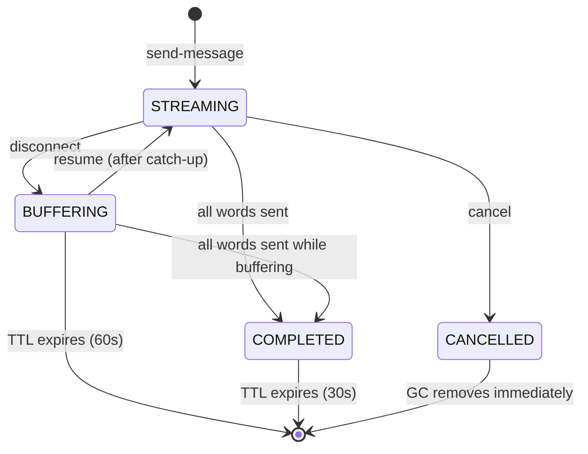

# Interview Prep Notes

This is a personal cheat sheet. Not for reviewers.

---

## Elevator Pitch

This is a real-time streaming chat system built with NestJS and socket.io on the backend and SwiftUI with the official socket.io Swift client on iOS. The server streams a predefined text at 5 words/sec, supporting mid-stream cancellation and transparent reconnect/resume. Session identity uses client-generated UUIDs to survive socket.io reconnects. During disconnects, the server continues buffering words and flushes them as a rapid catch-up batch on resume.

---

## Message Protocol

| Event | Direction | Payload | Purpose |
|-------|-----------|---------|---------|
| `send-message` | Client -> Server | `{ messageId, text }` | Start streaming a response |
| `stream-chunk` | Server -> Client | `{ messageId, word, index }` | One word of the stream |
| `stream-end` | Server -> Client | `{ messageId, totalWords }` | Stream finished normally |
| `cancel` | Client -> Server | `{ messageId }` | Stop the stream |
| `stream-cancelled` | Server -> Client | `{ messageId, lastIndex }` | Confirms cancellation |
| `resume` | Client -> Server | `{ messageId, lastWordIndex }` | Reconnected, request catch-up |
| `catch-up` | Server -> Client | `{ messageId, words: [{word, index}] }` | Batch of missed words |
| `error` | Server -> Client | `{ messageId?, message }` | Error notification |

---

## State Machine



---

## Reconnect Path Walk-Through

Use this when screen-sharing the code. Walk through these files in order:

**Step 1: User sends a message.**
- `ChatViewModel.swift:36-52` -- `sendMessage()` generates a UUID, appends user and server bubbles, sets `currentMessageId` and `lastWordIndex = -1`, emits `send-message`.
- `chat.gateway.ts:65-112` -- `handleSendMessage` validates, creates a `StreamSession`, links socket to message, calls `session.start()`.
- `stream-session.ts:42-49` -- `start()` saves the socketId and callback, starts `setInterval` at 200ms.

**Step 2: Words stream at 5 wps.**
- `stream-session.ts:53-79` -- `tick()` reads `words[currentIndex]`, emits `stream-chunk` via the callback.
- `chat.gateway.ts:103-108` -- The callback resolves the current socketId and emits via `server.to(socketId)`.
- `ChatViewModel.swift:83-86` -- `onStreamChunk` calls `appendWord`.
- `ChatViewModel.swift:130-139` -- `appendWord` guards `index > lastWordIndex`, appends word to `streamedText`.

**Step 3: Network drops.**
- `chat.gateway.ts:43-61` -- `handleDisconnect` fires. Iterates `socketToMessages` for this socket. Calls `session.pause()` for each message.
- `stream-session.ts:100-112` -- `pause()` sets state to `BUFFERING`, nulls out `socketId` and `emitCb`, records `disconnectedAt`. Timer keeps running.
- `stream-session.ts:69-71` -- Subsequent ticks hit the `BUFFERING` branch: `this.buffer.push({ word, index })`.

**Step 4: Client side during disconnect.**
- `SocketService.swift:86-91` -- Disconnect callback fires.
- `ChatViewModel.swift:78-81` -- Sets `connectionState = .reconnecting`.
- `ChatView.swift:10-12` -- `ConnectionBanner` appears.

**Step 5: Network restored, client auto-reconnects.**
- `SocketService.swift:35-37` -- socket.io-client-swift config: `reconnects(true)`, `reconnectWait(1)`, `reconnectWaitMax(5)`.
- `SocketService.swift:80-84` -- Connect handler fires.
- `ChatViewModel.swift:65-76` -- `onConnect` sets `.connected`. Detects active stream (`currentMessageId != nil && isStreaming`). Calls `socketService.resumeStream(messageId:, lastWordIndex:)`.
- `SocketService.swift:68-73` -- Emits `resume` event.

**Step 6: Server processes resume.**
- `chat.gateway.ts:142-199` -- `handleResume` validates, finds session, updates socket mappings (`unlinkMessage` + `linkSocketToMessage`), creates new emit callback, calls `session.resume()`.
- `stream-session.ts:118-153` -- `resume()` rebuilds catch-up from `words[lastWordIndex+1..currentIndex-1]`, clears buffer, sets state to `STREAMING`.
- `chat.gateway.ts:192-194` -- Emits `catch-up` if there are missed words.

**Step 7: Client processes catch-up and resumes.**
- `ChatViewModel.swift:95-100` -- `onCatchUp` iterates words, calls `appendWord` for each.
- `ChatViewModel.swift:135` -- Guard `index > lastWordIndex` prevents duplicates.
- Normal `stream-chunk` events resume on the new socket.

---

## Answers to Expected Questions

### 1. How does the WebSocket connection work?

The backend uses NestJS's `@WebSocketGateway` which wraps socket.io. The iOS client uses the official `socket.io-client-swift` library with forced WebSocket transport and auto-reconnect. On connect, the server logs the socket ID. The client can immediately start emitting events. All communication is event-based with JSON payloads identified by `messageId`.

### 2. How is streaming implemented?

A `setInterval` at 200ms (5 wps) advances through a word array. Each tick reads the word at the current index and emits a `stream-chunk` event with the word and its index. The client appends each word to the displayed text. When all words are sent, the server emits `stream-end` and clears the timer.

### 3. How does cancellation stop the server response?

The client emits a `cancel` event with the `messageId`. The server finds the corresponding `StreamSession`, calls `cancel()` which clears the interval timer and marks the state as `CANCELLED`. The server emits `stream-cancelled` back to the client, then destroys the session. The client marks the message as no longer streaming and shows the partial text as final.

### 4. How does reconnect/resume work after a temporary disconnect?

On disconnect, the server pauses the session but keeps the timer running -- words go into an in-memory buffer instead of the socket. When the client reconnects (new socket.id), it detects an active stream and emits `resume` with the last word index it received. The server reconstructs all missed words from the corpus, sends them as a single `catch-up` batch, rebinds the emit callback to the new socket, and resumes normal streaming.

### 5. What tradeoffs did you make?

In-memory storage means no persistence across server restarts. Buffering instead of pausing means the server does unnecessary work if the client never comes back, but enables instant catch-up which feels much better. No auth, no horizontal scaling, no backpressure. The 60s TTL for buffering sessions is a practical default but arbitrary.

### 6. What would you improve with more time?

Redis-backed sessions for horizontal scaling. JWT auth on the socket.io handshake. Backpressure detection (check transport writability before emitting). Rate limiting. Persistent chat history in a database. E2E tests with a real iOS simulator. Prometheus metrics for active sessions and reconnect rates. Configurable streaming rate.

---

## Likely Follow-Up Questions

### 1. What if two devices use the same messageId?

They would interfere. When device B sends `resume` for the same messageId, the server rebinds the emit callback to device B's socket. Device A would stop receiving chunks. In production, auth would tie a messageId to a user/device pair.

### 2. Why buffer instead of pause?

Buffering mimics LLM behavior -- the model does not stop generating because the client dropped. It enables instant catch-up: all missed words are already computed. Pausing would mean the user waits the full remaining duration after reconnect, which feels broken.

### 3. How would this scale to N servers?

Right now it does not -- sessions are in-process memory. You would need Redis or a similar shared store for session state, plus sticky sessions or a Redis-backed socket.io adapter (`@socket.io/redis-adapter`) so events route to the right server.

### 4. What breaks if the server restarts mid-stream?

Everything. All sessions are lost. The client would reconnect, emit `resume`, and get an error ("No session found"). You would need persistent session storage to survive restarts.

### 5. How do you prevent duplicate words after catch-up?

The client tracks `lastWordIndex` (`ChatViewModel.swift:135`). The `appendWord` method guards with `index > lastWordIndex` -- if a word's index is at or below what we already have, it is silently dropped.

### 6. Why socket.io instead of raw WebSocket?

Socket.io gives us structured events (named channels), automatic reconnect with backoff, room-based emit (`server.to(socketId)`), and the Engine.IO framing/heartbeat layer. With raw WebSocket you have to build all of that yourself plus handle the binary framing.

### 7. What happens if the client sends resume for a non-existent messageId?

The server returns an `error` event: `"No session found for this messageId"` (`chat.gateway.ts:163-167`). The client receives it and appends an error message to the chat.

### 8. Could you use Server-Sent Events instead?

SSE is unidirectional (server to client). You would still need a separate channel for client-to-server events (cancel, resume). WebSocket/socket.io gives bidirectional communication on a single connection, which is simpler for this use case.

### 9. How would you add authentication?

A JWT middleware on the socket.io handshake. The client sends the token in `auth` during connection. The server verifies it in a NestJS guard or middleware before allowing the connection. On resume, you would also verify that the authenticated user owns the messageId.

### 10. What if the text was 1 million words?

The buffer would grow large. You would need to cap buffer size, stream from disk/database instead of holding the full corpus in memory, and implement backpressure. The current approach of holding `CORPUS_WORDS` as an in-memory array works for ~500 words but not for millions.

---

## Five Live-Change Requests

### 1. Change streaming rate to 10 words per second

**File:** `backend/src/chat/stream-session.ts`

Before:
```typescript
this.timer = setInterval(() => {
  this.tick();
}, 200);
```

After:
```typescript
this.timer = setInterval(() => {
  this.tick();
}, 100);
```

Change is on line 47-49. The interval drops from 200ms to 100ms, doubling the rate from 5 to 10 wps.

---

### 2. Add a typing indicator event

**File:** `backend/src/chat/stream-session.ts`

Before (`start` method, line 42-49):
```typescript
start(socketId: string, emitCallback: EmitCallback): void {
  this.socketId = socketId;
  this.emitCb = emitCallback;
  this.state = SessionState.STREAMING;

  this.timer = setInterval(() => {
    this.tick();
  }, 200);
}
```

After:
```typescript
start(socketId: string, emitCallback: EmitCallback): void {
  this.socketId = socketId;
  this.emitCb = emitCallback;
  this.state = SessionState.STREAMING;

  emitCallback('typing-start', { messageId: this.messageId });

  this.timer = setInterval(() => {
    this.tick();
  }, 200);
}
```

Then in the `complete` method (line 82-93), before setting state to COMPLETED:
```typescript
private complete(): void {
  this.clearTimer();

  if (this.state === SessionState.STREAMING && this.emitCb) {
    this.emitCb('typing-stop', { messageId: this.messageId });
    this.emitCb('stream-end', {
      messageId: this.messageId,
      totalWords: this.words.length,
    });
  }

  this.state = SessionState.COMPLETED;
  this.disconnectedAt = Date.now();
}
```

---

### 3. Persist sessions to Redis

**File:** `backend/src/chat/session-manager.ts`

Before:
```typescript
@Injectable()
export class SessionManager implements OnModuleDestroy {
  private readonly logger = new Logger(SessionManager.name);
  public readonly sessions = new Map<string, StreamSession>();
```

After (conceptual -- requires `ioredis` dependency):
```typescript
import Redis from 'ioredis';

@Injectable()
export class SessionManager implements OnModuleDestroy {
  private readonly logger = new Logger(SessionManager.name);
  private readonly redis = new Redis(process.env.REDIS_URL);
  public readonly sessions = new Map<string, StreamSession>(); // local cache

  async persistSession(messageId: string, session: StreamSession): Promise<void> {
    await this.redis.set(
      `session:${messageId}`,
      JSON.stringify({
        messageId: session.messageId,
        currentIndex: session.currentIndex,
        state: session.state,
        buffer: session.buffer,
      }),
      'EX',
      60,
    );
  }

  async restoreSession(messageId: string): Promise<StreamSession | undefined> {
    const data = await this.redis.get(`session:${messageId}`);
    if (!data) return undefined;
    const parsed = JSON.parse(data);
    const session = new StreamSession(parsed.messageId);
    session.currentIndex = parsed.currentIndex;
    session.state = parsed.state;
    session.buffer = parsed.buffer;
    return session;
  }
```

You would also call `persistSession` in the `pause()` path and `restoreSession` in the `handleResume` path.

---

### 4. Add JWT authentication

**File:** `backend/src/chat/chat.gateway.ts`

Before:
```typescript
@WebSocketGateway({ cors: { origin: '*' } })
export class ChatGateway implements OnGatewayConnection, OnGatewayDisconnect {
```

After:
```typescript
import { verify } from 'jsonwebtoken';

@WebSocketGateway({ cors: { origin: '*' } })
export class ChatGateway implements OnGatewayConnection, OnGatewayDisconnect {
  @WebSocketServer()
  server!: Server;

  afterInit(server: Server): void {
    server.use((socket, next) => {
      const token = socket.handshake.auth?.token;
      if (!token) {
        return next(new Error('Authentication required'));
      }
      try {
        const payload = verify(token, process.env.JWT_SECRET!);
        (socket as any).userId = (payload as any).sub;
        next();
      } catch {
        next(new Error('Invalid token'));
      }
    });
  }
```

On the iOS side, add the token to `SocketService.init()`:
```swift
manager = SocketManager(
    socketURL: Self.serverURL,
    config: [
        .forceWebsockets(true),
        .reconnects(true),
        .reconnectWait(1),
        .reconnectWaitMax(5),
        .connectParams(["token": authToken]),
        .log(false)
    ]
)
```

---

### 5. Add backpressure handling

**File:** `backend/src/chat/stream-session.ts`

Before (`tick` method, line 62-68):
```typescript
if (this.state === SessionState.STREAMING && this.emitCb) {
  const payload: StreamChunkPayload = {
    messageId: this.messageId,
    word,
    index,
  };
  this.emitCb('stream-chunk', payload);
}
```

After:
```typescript
if (this.state === SessionState.STREAMING && this.emitCb) {
  if (this.socketWritable) {
    const payload: StreamChunkPayload = {
      messageId: this.messageId,
      word,
      index,
    };
    this.emitCb('stream-chunk', payload);
  } else {
    // Socket buffer is full; buffer locally until drain
    this.buffer.push({ word, index });
  }
}
```

Add a `socketWritable` flag and have the gateway set it based on the socket's `drain` event:
```typescript
// In chat.gateway.ts, after linking socket:
socket.conn.on('drain', () => {
  const session = this.sessionManager.getSession(messageId);
  if (session) session.socketWritable = true;
});
```

This prevents the server from flooding a slow client and falling back to buffering when the transport cannot keep up.
